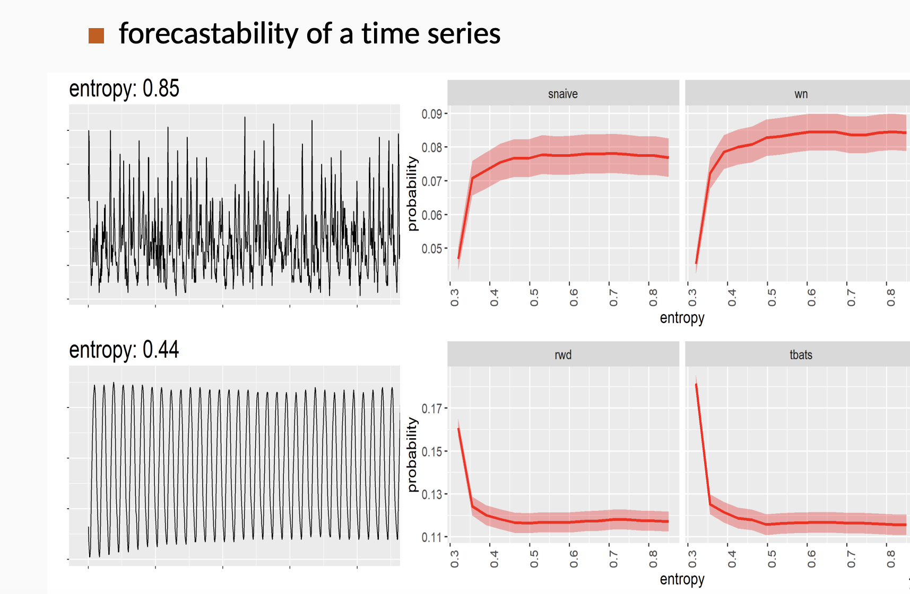

```{r xaringan-themer, include=FALSE, warning=FALSE}
library(xaringanthemer)
style_mono_accent(
  base_color = "#081d58",
  text_bold_color = "#ce1256",
  title_slide_text_color = "#edf8b1",
  header_font_google = google_font("Josefin Sans"),
  base_font_size = "20px",
  text_font_size = "1.5rem",
  code_font_size = "1rem"
 #text_font_google   = google_font("Montserrat", "300", "300i")
 # code_font_google   = google_font("Fira Mono")
)
```


```{r setup, include=FALSE}
library(knitr)
options(htmltools.dir.version = FALSE)
#read_chunk("src/main.R")
library(ggplot2)
library(patchwork)
library(reshape2)
library(grid)
library(gridExtra)
library(ggrepel)
library(png)
library(tsfeatures)
library(tidyverse)
library(ggpubr)
library(RColorBrewer)
library(dplyr)
library(forecast)
library(tidyr)
library(rlang)
library(tidyverse)
library(tsfeatures)
```

# About me

- PhD in Statistics and Mathematics, Monash University, Australia

--
- Senior Lecturer, Department of Statistics, University of Sri Jayewardenepura

--
- Co-founder and Co-organizer, R Ladies-Colombo

--
- Coordinator, Statistical Consultancy Service, University of Sri Jayewardenepura

--
- Founder and lead maintainer, [Dengue Data Hub](https://denguedatahub.netlify.app/)

--

Current research interests: Time Series Analysis, Data Visualization, Machine Learning, Machine Learning Interpretability,
Algorithm Selection, Open-science, Reproducible Research

--

November, 2023 highlights: [#30DayMapChallenge](https://30daymapchallenge.com/)


---
class: middle, center,

# Handling Massive Collections of 
# Time Series Data with 
# Feature Engineering

---

class: middle, center,

# Handling **Massive Collections** of 
# Time Series Data with 
# Feature Engineering

---
class: middle, center

# Handling **Massive Collections** of 
# **Time Series Data** with 
# Feature Engineering


---
background-image: url(dengue.jpg)
background-size: contain

---
class: middle, center
# `denguedatahub` R package installation


```{r, out.width = "300px", echo=FALSE, fig.pos="center"}
knitr::include_graphics("https://denguedatahub.netlify.app/logo.png")
```


`install.packages("denguedatahub")`

`library(denguedatahub)`


---

### District-wise Weekly Dengue cases from 2006 to 2023 - August

```{r, comment=NA, message=FALSE, warning=FALSE}
library(denguedatahub)
library(tsibble)
srilanka_weekly_data
```

---
class: middle, center

# Data visualization serves as a prerequisite for modeling.

--

## why?

--

It plays a crucial role in helping us better **grasp the patterns**, **relationships**, and **essential characteristics** of the data we're working with, making it easier to create accurate and effective models.

---

# Static chart

```{r, echo=FALSE, fig.width=15}
p1 <- srilanka_weekly_data %>%  
ggplot(aes(x=start.date, y=cases, col=district,
           group=district)) + geom_line()
p1
```

---

# Interactive chart

```{r, echo=FALSE, message=FALSE, warning=FALSE, fig.width=15}
library(plotly)
ggplotly(p1)
```

---

```{r, echo=FALSE, fig.width=15}
srilanka_weekly_data %>%  
ggplot(aes(x=start.date, y=cases)) + geom_line()  + 
  scale_x_date(date_breaks = "1 year", date_labels = "%Y") + 
  theme(axis.text.x = element_text(angle = 90, vjust = 0.5, hjust=1)) +
  facet_wrap(vars(district), scales = "free_y", ncol=5)
```

---


#### Number of series: 1

```{r, echo=FALSE, message=FALSE, warning=FALSE, comment=NA}
library(tidyverse)
library(coronavirus)
coronavirus <- coronavirus %>% mutate(cases = replace(cases, which(cases<0), NA))
coronavirus <- coronavirus %>% mutate(cases = replace(cases, which(cases>800000), 800))
#confirmed <- coronavirus %>% filter(type == "confirmed")
confirmed <- coronavirus %>% 
  filter(type == "confirmed") %>%
  group_by(country, date) %>%
  summarise(cases = sum(cases)) 
```

```{r, echo=FALSE, fig.width=15, fig.height=6, warning=FALSE, message=FALSE}
library(plotly)
p <- ggplot(confirmed, aes(x=date, y=cases)) + geom_line(colour=NA) +  theme(legend.position = "none")
p + geom_line(data = subset(confirmed,  country == "Norway"),color = "red") + theme(legend.position = "none") + ylim(c(0, 800)) + ylab("Sales")
```

---
#### Number of series: 2

```{r, echo=FALSE, fig.width=15, fig.height=6, warning=FALSE, message=FALSE}
library(plotly)
p <- ggplot(confirmed, aes(x=date, y=cases)) + geom_line(colour=NA) +  theme(legend.position = "none")
p + geom_line(data = subset(confirmed,  country == "Norway"),color = "red") + geom_line(data = subset(confirmed,  country == "China"),color = "#7570b3") + theme(legend.position = "none") + ylim(c(0, 800)) + ylab("Sales")
```


---

#### Number of series: 3

```{r, echo=FALSE, fig.width=15, fig.height=6, warning=FALSE, message=FALSE}
library(plotly)
p <- ggplot(confirmed, aes(x=date, y=cases)) + geom_line(colour=NA) +  theme(legend.position = "none")
p + geom_line(data = subset(confirmed,  country == "Norway"),color = "red") + geom_line(data = subset(confirmed,  country == "China"),color = "#7570b3") + geom_line(data = subset(confirmed,  country == "Australia"),color = "#1b9e77") +
  theme(legend.position = "none") + ylim(c(0, 800)) + ylab("Sales")
```

---


## Number of series: 10

```{r, echo=FALSE, fig.width=15, fig.height=6, warning=FALSE, message=FALSE}
library(plotly)
p <- ggplot(confirmed, aes(x=date, y=cases)) + geom_line(colour=NA) +  theme(legend.position = "none")
p + geom_line(data = subset(confirmed,  country == "Norway"),color = "red") + geom_line(data = subset(confirmed,  country == "China"),color = "#7570b3") + geom_line(data = subset(confirmed,  country == "Australia"),color = "#1b9e77") +
  geom_line(data = subset(confirmed,  country == "Sri Lanka"),color = "#ff7f00") +
  geom_line(data = subset(confirmed,  country == "Ireland"),color = "#6a3d9a") +
  geom_line(data = subset(confirmed,  country == "Colombia"),color = "#1f78b4") +
  geom_line(data = subset(confirmed,  country == "Russia"),color = "#b2df8a") +
  geom_line(data = subset(confirmed,  country == "Mexico"),color = "#fdbf6f") +
  geom_line(data = subset(confirmed,  country == "Canada"),color = "#fb9a99") +
  geom_line(data = subset(confirmed,  country == "Poland"),color = "#cab2d6") +
  theme(legend.position = "none") + ylim(c(0, 800)) + ylab("Sales")
```

---


## Number of series: More than 100

```{r, echo=FALSE, fig.width=15, fig.height=6, warning=FALSE, message=FALSE}
library(plotly)
p <- ggplot(confirmed, aes(x=date, y=cases, colour=country)) + geom_line() +  theme(legend.position = "none")
p + theme(legend.position = "none") + ylim(c(0, 800)) + ylab("Sales")
```


---
background-image: url(https://thiyanga.netlify.app/post/positimages/site.png)
background-size: contain

# Posit conf::2023, Hyatt Regency in Chicago, Illinois, USA 

---
background-image: url(usgs.png)
background-size: contain
---
class: middle, center

# Handling **Massive Collections** of 
# **Time Series Data** with 
# **Feature Engineering**

---


background-image: url(img/tukey.jpeg)
background-size: 200px
background-position: 100% 6%

# Time series features

- **Cognostics**: **Co**mputer-aided dia**gnostics** (John W. Tukey, 1985)

- Characteristics of time series

- Summary measures of time series


**Basic Principle**

- Transform a given time series $y=\{y_1, y_2, \cdots, y_n\}$ into a feature vector $F = (f_1(y), f_2(y), \cdots, f_p(y))'$. 


---

.pull-left[
#### Time-domain representation

```{r, comment=NA, message=FALSE, warning=FALSE, echo=FALSE}
library(Mcomp)
library(ggplot2)
library(grid)
library(gridExtra)
library(ggrepel)
library(png)
library(tsfeatures)
library(tidyverse)
library(ggpubr)
# Extract required series
series_id <- c("N0001", "N0633", "N0625", "N0645","N1912", "N2012")
color = c("#1b9e77", "#d95f02", "#7570b3", "#e7298a", "#66a61e", "#e6ab02")
model <- c("Random walk with drift", "NAIVE", "Random walk with drift", "NAIVE", "ETS", "SARIMA")
six_series <- lapply(M3[series_id], function(u){u$x})
p <- lapply(six_series,
function(u) {autoplot(u) + xlab("") + ylab("")}
)
for (i in seq_along(six_series))
p[[i]] <- p[[i]] +geom_line(color=color[i]) +ggtitle(series_id[i], model[i])+theme(title =element_text(size=10, face='bold'))
grid.arrange(grobs = p, ncol = 2)
```

]

--

.pull-right[

#### Time series features

- Strength of trend


- Strength of seasonality


```{r, comment=NA, message=FALSE, warning=FALSE, echo=FALSE}
df <- tsfeatures(six_series, c("stl_features")) %>%
  select(trend, seasonal_strength) %>%
  rename(seasonality = seasonal_strength) %>%
  replace_na(list(seasonality = 0))
df$id <- names(six_series)

df

```

]


---
# STL decomposition

.pull-left[


```{r, comment=NA, message=FALSE, warning=FALSE, echo=FALSE}
x <-as.ts(M3[2012]$N2012$x, freq=12)
x |>
 stl(t.window=13, s.window="periodic", robust=TRUE) |>
 autoplot()

```


]


.pull-right[


$$y_t = T_t + S_t + R_t$$

$$F_T = max \left(0, 1 - \frac{Var(R_t)}{Var(T_t + R_t)} \right)$$

$$F_S = max \left(0, 1 - \frac{Var(R_t)}{Var(S_t + R_t)} \right)$$

]

STL is an acronym for “Seasonal and Trend decomposition using Loess”. More info click [here](https://otexts.com/fpp2/stl.html).

---


.pull-left[
#### Time-domain representation

```{r, comment=NA, message=FALSE, warning=FALSE, echo=FALSE}
library(Mcomp)
library(ggplot2)
library(grid)
library(gridExtra)
library(ggrepel)
library(png)
library(tsfeatures)
library(tidyverse)
library(ggpubr)
# Extract required series
series_id <- c("N0001", "N0633", "N0625", "N0645","N1912", "N2012")
color = c("#1b9e77", "#d95f02", "#7570b3", "#e7298a", "#66a61e", "#e6ab02")
six_series <- lapply(M3[series_id], function(u){u$x})
p <- lapply(six_series,
function(u) {autoplot(u) + xlab("") + ylab("")}
)
for (i in seq_along(six_series))
p[[i]] <- p[[i]] +geom_line(color=color[i]) +ggtitle(series_id[i])+theme(title =element_text(size=10, face='bold'))
grid.arrange(grobs = p, ncol = 2)
```

]

--

.pull-right[

#### Feature-domain representation

```{r, comment=NA, message=FALSE, warning=FALSE, echo=FALSE}
df <- tsfeatures(six_series, c("stl_features")) %>%
  select(trend, seasonal_strength) %>%
  rename(seasonality = seasonal_strength) %>%
  replace_na(list(seasonality = 0))
df$id <- names(six_series)
ggplot(df, aes(x = trend, y = seasonality)) +
  geom_point(size = 5, color = c("#1b9e77", "#d95f02", "#7570b3", "#e7298a", "#66a61e", "#e6ab02")) +
  xlim(0, 1) + ylim(0, 1) +
  xlab("Strength of trend") + 
  ylab("Strength of seasonality") + 
  coord_fixed() +
  geom_text_repel(
    aes(label = id),
    colour = "black",
    size = 5,
    box.padding = unit(0.5, "lines")
  ) +
  theme(legend.position = "none")
```

]

---

# R code

```{r}
six_series
```

---
# R code

```{r}
library(tsfeatures)
tsfeatures(six_series, c("stl_features")) |>
  select(trend, seasonal_strength) 
```

---

## Examples of time series features

.pull-left[

- length

- strength of trend

- strength of seasonality

- lag-1 autocorrelation

- spectral entropy

- proportion of zeros

- spikiness

]

.pull-right[

- curvature

- linearity

- stability

- number of peaks

- parameter estimates of Holt-Winters' additive method

- unit root test statistics

]
---

# `tsfeatures` package

.pull-left[

## R installation

```{r, fig.width=7, echo=FALSE, fig.pos="center"}

```  

`install.packages('tsfeatures')`

]

.pull-right[

## Python installation

```{r, fig.width=6, echo=FALSE, fig.pos="center"}

```

`pip install tsfeatures`


]

---

## Example: tsfeatures in R

```{r}
tslist <- list(sunspot.year, WWWusage, AirPassengers, USAccDeaths)
features <- tsfeatures(tslist)
features

```

---

# tidyverse

```{r, warning=FALSE}
library(tidyverse)
```


---
#tidyver~se~

```{r, warning=FALSE}
library(tidyverse)
```
---
#tidyverts


---

## Large-scale time series visualization

Demo: https://thiyangt.github.io/fformsviz/fforms.html

[Short demo](https://twitter.com/i/status/1634754298377560064)

[Dengue data visualization](https://denguedatahub.netlify.app/viz)

---
class: center, middle, inverse

# Which time series features should be used?
---

```{r, echo=FALSE, fig.width=15, message=FALSE, warning=FALSE}
library("sarima")
set.seed(1228)
x1 <- sim_sarima(n=144, model = list(ma=0.8)) + 10               # MA(1)
x2 <- sim_sarima(n=144, model = list(ar=0.8))               # AR(1)
x3 <- sim_sarima(n=144, model = list(ar=c(rep(0,11),0.6))) + 10 # SAR(1), 12  seasons
x4 <- sim_sarima(n=144, model = list(ar=c(rep(0,11),0.6)))  # SMA(1)
ts <- c(x1, x2, x3, x4)
class <- as.factor(rep(1:4, each=144))
time <- rep(1:144, times=4)
dfts <- data.frame(ts, class, time)
ggplot(dfts, aes(x=time, y=ts, group=class, col=class)) +
  geom_line() 
```

---

```{r, fig.width=15, message=FALSE, warning=FALSE, echo=FALSE}
library("sarima")
set.seed(1228)
x1 <- sim_sarima(n=144, model = list(ma=0.8)) + 10               # MA(1)
x2 <- sim_sarima(n=144, model = list(ar=0.8))               # AR(1)
x3 <- sim_sarima(n=144, model = list(ar=c(rep(0,11),0.6))) + 10 # SAR(1), 12  seasons
x4 <- sim_sarima(n=144, model = list(ar=c(rep(0,11),0.6)))  # SMA(1)
ts <- c(x1, x2, x3, x4)
class <- as.factor(rep(1:4, each=144))
time <- rep(1:144, times=4)
dfts <- data.frame(ts, class, time)
ggplot(dfts, aes(x=time, y=ts, group=class, col=class)) +
  geom_line() + scale_color_manual(values=c("red", "red", "black",  "black"))
```

---

```{r, fig.width=15, message=FALSE, warning=FALSE, echo=FALSE}
library("sarima")
set.seed(1228)
x1 <- sim_sarima(n=144, model = list(ar=0.8)) + 10               # MA(1)
x2 <- sim_sarima(n=144, model = list(ar=0.8))               # AR(1)
x3 <- sim_sarima(n=144, model = list(ar=c(rep(0,11),0.6))) + 10 # SAR(1), 12  seasons
x4 <- sim_sarima(n=144, model = list(ar=c(rep(0,11),0.6)))  # SMA(1)
ts <- c(x1, x2, x3, x4)
class <- as.factor(rep(1:4, each=144))
time <- rep(1:144, times=4)
dfts <- data.frame(ts, class, time)
ggplot(dfts, aes(x=time, y=ts, group=class, col=class)) +
  geom_line() + scale_color_manual(values=c("red", "black", "red",  "black"))
```

---

class: center, middle

# Feature-based time series forecasting


---

class: inverse, center, middle
background-image: url(img/f1.png)
background-size: contain


---
class: inverse, center, middle
background-image: url(img/f2.png)
background-size: contain

---
class: inverse, center, middle
background-image: url(img/f3.png)
background-size: contain

---
class: inverse, center, middle
background-image: url(img/f4.png)
background-size: contain

---
class: inverse, center, middle
background-image: url(img/f5.png)
background-size: contain

---
class: inverse, center, middle
background-image: url(img/f6.png)
background-size: contain

---
class: inverse, center, middle
background-image: url(img/f7.png)
background-size: contain


---
class: inverse, center, middle
background-image: url(img/f8.png)
background-size: contain

---
class: inverse, center, middle
background-image: url(img/f9.png)
background-size: contain

---
class: inverse, center, middle
background-image: url(img/f10.png)
background-size: contain


---
class: inverse, center, middle
background-image: url(img/f11.png)
background-size: contain

---
class: inverse, center, middle
background-image: url(img/f12.png)
background-size: contain

---
class: inverse, center, middle
background-image: url(img/f13.png)
background-size: contain


---


### FFORMS: **F**eature-based **FOR**ecast **M**odel **S**election


.pull-left[

seer (magic ball)

```{r   out.width = "50%", echo = FALSE, fig.cap=''}
knitr::include_graphics("img/seer.png")
```


```{r, comment=NA, eval=FALSE}
install.packages("seer")
#library(devtools)
#install_github("thiyangt/seer")
library(seer)
```

]

--

.pull-right[

Acropolis Museum, Athens, Greece

```{r   out.width = "60%", echo = FALSE, fig.cap=''}
knitr::include_graphics("img/greece.JPG")
```


]


---
class: inverse
background-image: url(img/forest.jpg)
background-size: cover

## Random forest

---
class: center, inverse, middle
background-image: url(img/forest.jpg)
background-size: cover

# Can we trust ML-algorithms if we don't know how it works?

---
class: inverse
background-image: url(img/forest.jpg)
background-size: cover

# Peeking inside FFORMS Random forest

---
# Peeking inside FFORMS Random forest

- Which features are the most important? 

- Where are they important?

- How are they important?

--

> Machine learning interpretability methods.


Paper: Talagala, T. S., Hyndman, R. J., & Athanasopoulos, G. (2023). Meta‐learning how to forecast time series. Journal of Forecasting, 42(6), 1476-1501.
---

## Partial dependency plots for hourly data: entropy

```{r   out.width="80%", echo = FALSE, fig.cap=''}

```

---
## Recap

--

- Time series features

--

- Storing

--
- Data visualizzation

--

- Forecasting

--

- Clustering

--
- Anomaly detection

---


---
class: center, middle

```{r, out.width = "800px", echo=FALSE, fig.pos="center"}

```

Source: https://prital.netlify.app/talks/f4sg2023/f4sg-talk#5

Contact: ~~Thiyanga~~ Priyanga Dilini Talagala
---
class: center, middle

# Thank You!

```{r, echo=FALSE}
anicon::faa("twitter", animate="float", size=3, colour="lightblue")
```

```{r, echo=FALSE}
anicon::faa("github", animate="float", size=3, colour="black")
```

# @thiyangt


### web: https://thiyanga.netlify.app

# email: ttalagala@sjp.ac.lk